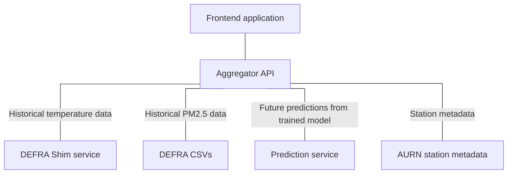

# COMP3000 Project - Metadata

## What is this?

This repository contains a script that populates a MongoDB database with metadata about the AURN network, provided by the pyaurn library, and deployment infrastructure.

## Navigation



- [Frontend](https://github.com/Lewis-Trowbridge/COMP3000-Project-Frontend)
- [Aggregator](https://github.com/Lewis-Trowbridge/COMP3000-Project-Backend-API)
- [Predictions](https://github.com/Lewis-Trowbridge/COMP3000-Project-Machine-Learning)
- Metadata (you are here)
- [Shim](https://github.com/Lewis-Trowbridge/COMP3000-Project-DEFRA-Shim)

## How is it made?

This script is a Python script that uses the pyaurn library, running as a Cloud Run Job every 24 hours to populate and update a hosted MongoDB instance. The script uses environment variables to log into the database:

- `MONGO_DB_USER`: The username to log in with
- `MONGO_DB_PASS`: The password to log in with

## How do I use it?

The system is currently hardcoded to update the hosted MongoDB instance. Ensure the correct environment variables are set and follow the instructions to update the database below:

1. Install requirements

```bash
pip install -r requirements.txt
```

2. Run script

```bash
python main.py
```
